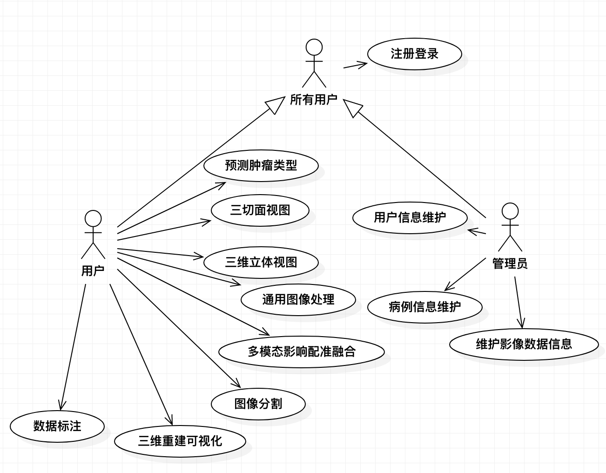
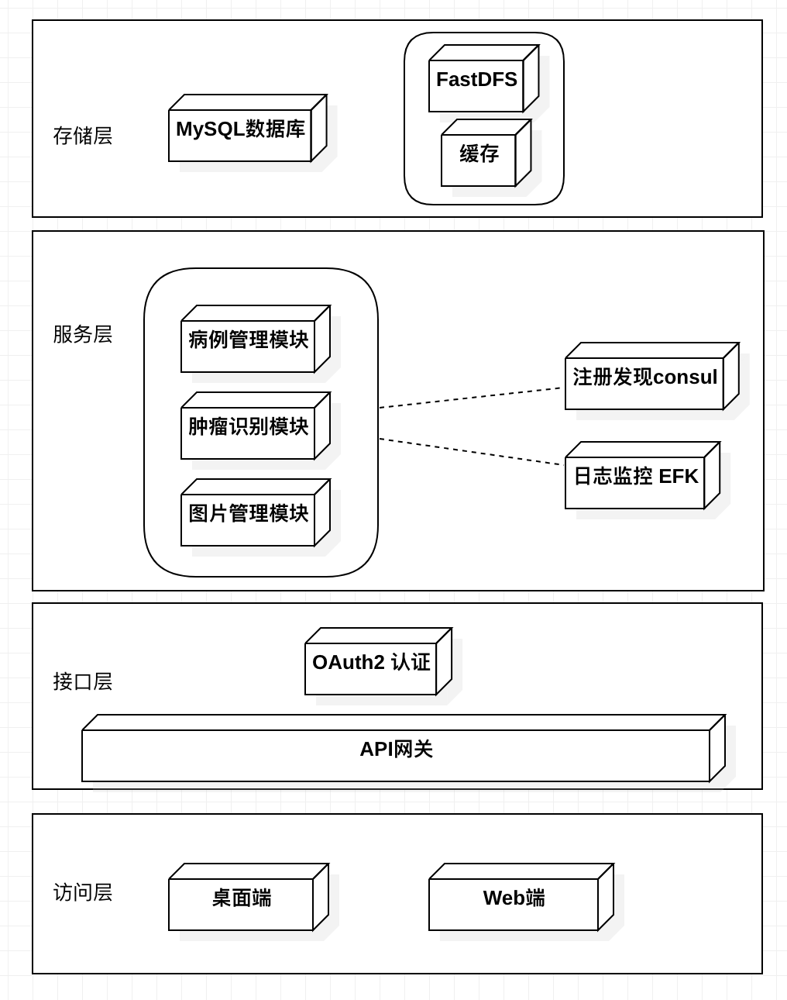

<b>“多模态医学影像配准、分割与可视化系统”</b>

团队成员：张诏崴、罗媚、李陈豪、张祥宁、赵语云

# 立项申请书

## 一、 项目的必要性

**1. 项目背景**

如今，随着计算机断层扫描、核磁共振等成像技术的出现和其在临床上的广泛使用，医学诊断和治疗技术取得了极大的进展。但是，二维图像只能显示某个切面内像素之间的相关关系，缺乏对三维对象的感知；将二维断层医学图像序列通过一定的三维重建算法形成具有真实感的立体效果图像，并通过人机交互界面，使用平移、缩放、旋转、透视、剖面等方法多角度全方位显示医学图像的内部复杂结构，可以帮助医生客观、准确的进行病体观察和病因分析，进而指导手术或制订治疗计划和评估术后效果，提高医疗诊断和分析的准确性和可靠性。因此，对医学影像数据的处理与可视化有着十分重要的研究价值和广阔的应用前景。

目前，现有的医学影像处理与分析软件平台在某些特定领域已经取得了巨大的成功，但是仍存在着如下不足：

1. 一些功能强大的商用医学影像处理与分析综合平台需要配套医疗设备或特殊硬件才能运行，其价格十分昂贵，不利于医疗工作者与高校科研人员学习使用；
2. 开源框架的软件平台二次开发学习成本过高，因为其所依赖的开源软件库过于庞大和复杂，不利于对编程开发不擅长的临床医师学习使用；
3. 由于医学影像数据本身的复杂多样性，使得现有软件平台的专业性太强，通用性不足。一些研究团队开发的医学影像处理软件平台都只能针对某种特定模态的影像，处理某种特定的任务，不能应用于其他医学影像处理领域；
4. 目前市面上免费开源的医学影像处理软件大多只能提供最为基础的功能，如三切面显示、纯手动勾画、简单的重建可视化，这些软件只能满足用户最基础的需求，倘若用户需要配准、分割、三维重建面绘制/体绘制等功能，其只能选择付费的商用软件或自行编程开发；
5. 目前大多医学影像处理软件都不含有病例数据信息存储功能，其无法回顾性地查看过往所处理的数据，并且其勾画标注的数据结果只能保存到本地，不能在远端数据库保存备份，不便于数据回顾与团队协作。

**2. 项目意义**

本项目旨在开发一套多模态医学影像配准、分割、可视化系统，集成常用的医学影像处理与分析算法，提供多模态影像配准融合、自动化图像分割、图像后处理、三维重建可视化、肿瘤良恶性预测、病例数据后端等功能，以满足医疗工作者与高校科研人员的各种实际临床需求，减少其在算法工具使用上的学习成本，帮助用户更加便捷地管理病例数据，为团队协作提供更多便利。

本项目通过提供集成了常用医学影像处理功能的用户端，为医疗工作者创造更加高效的工作条件，其中包括了多模态影像配准融合、图像的后期处理、三维重建可视化等功能，用户可以在同一平台中找到各种符合实际需求的医学影像处理功能。本项目还将搭建数据库后台，旨在储存建立医学影像及病例数据的数据库，在此基础上配合人工智能成一套针对病例的预测模型，辅助医疗工作者对病情的诊断，并且该数据库会为未来的科研和医疗工作者提供便利的研究素材。在用户使用产品前端的同时，也能够为后台数据库进行拓展补充，本项目提供的图像分割、勾画标注等功能允许用户将处理后的资料，如肿瘤病例中的肿瘤位置、良恶性、病例信息等，作为未来的研究资料录入数据库后端。

本项目通过集成常用医学影像处理方法，结合后端数据库，从而能够构建一套可成长的医学影像配准处理系统，在帮助医疗工作者更高效处理工作的同时，也为未来的研究工作提供坚实基础。

## 二、 项目外部条件落实情况

**1. 技术基础**

本项目在前端应用提供大量的医学影像处理功能，如三维数据三切面视图展示、多模态医学影像配准与融合、感兴趣区域分割、常用图像处理操作（如模糊、去噪、平滑等）、三维重建可视化（面绘制与体绘制）、感兴趣区域标注、病例数据信息存储等。

本项目通过微服务的架构构建系统后端，使用MySQL来存储数据，搭建图像数据服务器，进而让用户能够完成图像的获取，信息的备份，病例的管理等功能。

团队成员已掌握医学影像处理算法的基本原理与实现方法，前期已调研了大量医学影像配准、分割与可视化技术的相关文献与技术博客，掌握了医学影像处理开发所需要的第三方开源库：VTK、ITK，并已编程实现了部分核心算法，经测试可以应用于实际临床问题中；此外，团队成员已掌握前端开发技术，熟悉包括PC、Web、移动端各平台的开发环境，并熟悉C++、Python、Qt、MySQL等技术的使用；团队成员亦对人工智能，数据库搭建等技术有足够的熟悉程度；团队成员熟悉软件开发的基本流程，熟悉相应开发工具的使用。

**2. 研发团队**

团队拥有多位经验丰富的开发人员，且各个成员来自于不同专业，在技术上能够专业互补，经验共享，实现跨学科跨领域合作。团队成员分工明确，且均熟悉软件开发的基础流程，能够高效协作，快速开发，共同完成整个项目的构建。

**3. 项目组织机制设计**

本项目由 SJTU 公司高层亲自担任负责人，按照项目管理规范和基于 UML 的开发模式，全权负责对项目的设计和管理，协调开展。所有团队成员都对项目负责，保证项目在预期时间内取得圆满成功。

## 三、项目目标和创新点

**1. 项目主要目标**

本项目“多模态医学影像配准、分割与可视化系统”，提供桌面端应用供用户使用(医疗工作者与高校科研人员)，该桌面端应用为用户提供多模态影像配准融合、自动化图像分割、图像后处理、三维重建可视化、肿瘤良恶性预测、病例数据后端存储等功能。旨在满足医疗工作者与高校科研人员的各种实际临床需求，减少其在算法工具使用上的学习成本，帮助用户更加便捷地管理病例数据。

本项目的总体目标是：为用户提供全面的医学影像配准、分割、处理与可视化技术服务，基于人工智能技术自动检测肿瘤的类型，支持病例数据的后端，方便用户回顾性地查看过往所处理的数据。

**2. 项目创新点**

**1) 本项目桌面端应用功能丰富，能满足绝大多数医学影像处理需求**

不同于市面上大多医学影像处理软件只针对某些特定领域的任务，本项目开发的桌面端应用能够提供大量的医学影像处理功能，如三维数据三切面视图展示、多模态医学影像配准与融合、感兴趣区域分割、常用图像处理操作（如模糊、去噪、平滑等）、三维重建可视化（面绘制与体绘制）、感兴趣区域标注、病例数据信息存储等，这些功能够解决绝大多数的医学影像处理任务。尤其是多模态医学影像配准融合功能，因其所设计的技术较为复杂，该功能目前鲜有开源软件能够实现，本项目开发的应用能够提供多模态医学影像配准融合功能，满足需要这部分功能的用户的需求。

**2) 本项目拥有数据信息管理功能，能够存储病例信息，方便用户回顾性查看历史信息**

目前市面上的医学影像处理软件几乎都没有提供数据信息管理功能，用户的数据信息只能保存在本地磁盘，不能存储在远端服务器中。本项目拥有数据信息管理模块与数据后端存储模块，在后端数据库中存储用户的注册登录信息、病例基本信息与处理后的数据（如配准后的数据、分割与标注的数据）等，便于用户数据的备份、存储与管理，方便其回顾性查看过往历史数据。

**3) 本项目拥有基于人工智能的肿瘤类型自动预测功能**

目前，人工智能技术在医学影像诊断上有着越来越多的应用，各种文献都证明基于人工智能技术的肿瘤类型预测有着非常好的性能，可以应用于实际临床问题中。而目前市面上鲜有软件提供自动预测肿瘤类型的功能，本项目即抓住此痛点，在数据信息管理模块中添加基于人工智能的肿瘤类型预测功能，根据用户输入的图像数据自动预测肿瘤的类型，减轻医疗工作者的工作负担。

**4) 本项目可吸纳用户提供的标注数据进行二次训练加强模型性能**

本项目支持用户标注肿瘤数据信息，在提交后存储到后端数据库中，届时，在收取到足够的标注数据后，数据信息管理模块可在原先模型基础上进行二次训练，加强模型的鲁棒性与准确性，从而在预测新数据时能够取得更高的准确性与鲁棒性。

**3. 项目技术难点**

**1)  桌面端应用的多模态影像配准算法、分割算法实现难度较大**

图像配准算法与分割算法实现起来难度较大，且想要达到较高的精度较难，需要开发者耗费精力研究算法。

**2)  自动预测肿瘤类型实现难度较大**

基于人工智能预测肿瘤类型受数据量的限制，预测效果想要达到较高水平较难，需要开发者反复调参训练。

**3) 后端数据管理细节较多**

数据格式不统一导致文档识读错误问题；如何将多数据源规整到数据库中。

**4)  用户频繁上传数据可能造成服务器压力**

医学影像数据量较大，通常在十几兆~几十兆之间，导致用户频繁上传数据时可能造成服务器压力。

## 四、项目方案和可行性分析

**1. 项目方案**

"多模态医学影像配准、分割与可视化系统"项目采用基于 UML 的面向对象方法开发。桌面端应用使用第三方开源库Visualization Toolkit(VTK)与Insight Toolkit(ITK)进行医学影像处理算法的实现，采用CMake编译VTK与ITK，UI采用 C++、Qt 进行开发；使用 workbench 建立数据库模型；服务端使用 Python 开发，数据库使用 MySQL；使用 Github 管理项目，使用基于 Github 的 CI 来做持续集成，测试。

本项目的用例图如下所示：

本项目架构图如下图所示:

整个系统的架构分为以下 4 个部分：

**1） 访问层**

桌面端UI应用模块为用户提供了大量的医学影像处理功能，如三维数据三切面视图展示、多模态医学影像配准与融合、感兴趣区域分割、常用图像处理操作（如模糊、去噪、平滑等）、三维重建可视化（面绘制与体绘制）、感兴趣区域标注、病例数据信息存储等。用户可在桌面端应用中使用各种医学影像处理算法， 并可将原始病例数据与处理后的数据（如配准后的数据、分割与标注的数据）存储到后端数据库，实现高效数据管理，并方便其回顾性查看过往历史数据。

Web端让管理员能够完成对病例，用户以及图片资料的增删改查。

**2） 服务层**

系统采用微服务架构，所有服务都需要接入服务注册发现，同时系统通过 EFK 进行日志管理。

包括三个主要的服务：

- 病例管理
- 肿瘤识别
- 图片管理

病例管理负责对病例的增删改查操作。

肿瘤识别通过神经网络训练，能够让用户在桌面端获得肿瘤类型的信息。

图片管理完成对肿瘤图片的上传，下载操作，以及其他的增删改查功能。

**3） 存储层**

存储主要完成对病例数据与处理后的数据（如配准后的数据、分割与标注的数据）的后端存储，该模块将把用户提供的数据存储到后端数据库中，便于用户数据的备份、存储与管理，方便其回顾性查看过往历史数据。同时该模块要完成和桌面端UI应用接口的实现。

FastDFS 完成对图片的存储功能，加入缓存来保证效率。

**4) 接口层**

系统需要通过网关来管理所有接入服务的 HTTP 请求，所有的需要认证的请求都要通过 OAuth 模块。

**2. 具体技术方案**

**1） 桌面端UI应用模块**

- 该模块主要负责医学影像处理算法的实现，采用基于UML的面向对象方法开发；
- 读取的医学影像为DICOM格式或NIFTI格式；
- UI部分采用C++、Qt进行开发，开发工具为Visual Studio与Qt Creator；
- 实现医学影像算法部分使用第三方开源库Visualization Toolkit(VTK)与Insight Toolkit(ITK)进行开发，采用CMake编译VTK与ITK，开发工具为Visual Studio；
- Visualization Toolkit(VTK)主要负责可视化算法的实现，Insight Toolkit(ITK)主要负责图像处理算法的实现；
- 多模态医学影像配准算法采用基于互信息量的3D刚性配准算法，图像分割算法采用GraphCut3D算法，面绘制采用Marching Cubes算法，体绘制采用光线投影法，其他通用图像处理算法均采用国际上较为主流的算法。
- 该模块核心算法API介绍：

  - 配准算法：itk::ImageRegistrationMethod
  - 刚性形变：itk::VersorRigid3DTransform
  - 优化器：itk::VersorRigid3DTransformOptimizer
  - 互信息衡量：itk::MutualInformationImageToImageMetric
  - 分割算法：itk::GraphCutFilterType
  - 面绘制算法：vtk::MarchingCubes
  - 体绘制算法：vtk::FixedPointVolumeRayCastMapper
- 本项目将itk与vtk的相关核心算法API封装成自定义类以方便UI端调用；
- Qt界面与VTK的渲染窗口vtkRenderWindow采用提升后的QVTKWidget类进行连接；

**2） 数据信息管理模块**

- 数据信息管理模块包括图片处理服务，肿瘤识别服务和病例管理服务；
- 所有服务都需要在服务注册中心进行注册；
- 通过 EFK 进行系统日志管理；
- 采用 Python 进行开发，框架为 Flask，开发工具为 VIM；
- 肿瘤识别服务采用 pytorch 作为深度学习框架;
- 所有用户访问 API 的时候都要通过网关，通过OAuth认证才能访问服务;

**3） 数据后端存储模块**

- 该模块主要用来存储用户数据，病例数据和图片数据，其中图片数据考虑可能会有频繁访问的问题，可能会在其中加上一个缓存；
- 关系型数据库选择 MySQL，图片服务器选择FastDFS，会加入一个 Nginx 最为代理和缓存;

**4) web端应用模块**

- web端让管理员进行图片数据，用户数据以及病例数据的维护;
- 该模块使用 React 进行开发;

**3. 可行性分析**

**1）底层算法发展成熟**

本项目中所使用到的医学图像配准、分割、处理与三维重建可视化等算法的发展已经比较成熟，存在鲁棒性好、可用性高且已投入实际使用的算法。这些算法已被证实拥有良好的鲁棒性与准确性，可以应用于软件中解决实际临床问题。项目成员对医学图像处理算法有一定的了解，前期已阅读大量相关文献，熟悉算法原理与实现流程。

**2）技术框架成熟可靠，在商业上已有充分实施经验**

本项目中所使用到的技术框架皆为现在的一些主流框架，在商业上有着成功的实践。本项目中后端计划使用Python实现，Python作为现在最火爆的语言之一，在网络上有许多可查询的资料，且团队成员有丰富的基于Python开发项目的经验，对于基于Python连接数据库、面向http协议的接口编写等技术都有着实战的成功经历。后端计划使用Qt实现，Qt是一个功能十分强大的跨平台C++ GUI应用程序开发框架，对外提供了丰富的API和大量的开发文档，许多著名的软件例如Autodesk Maya、Virtual Box、Google Earth、Skype都是基于Qt完成的。且本团队成员中有两位有过Qt开发经历，三位同学对C++语言较为熟悉，因此本项目的技术方案可行性很强。

**3）技术团队综合技术优势明显**

本项目目前有5位成员，其中两名来自生物医学工程学院，对于医学图像处理的相关算法较为熟悉；其余三名来自软件学院，有着丰富的软件开发经验和扎实的软件开发基础知识。整体构成了一个专业互补、经验共享、协作高效的医学图像处理开发团队。

**4）法律因素可行性分析**

开发过程中使用到的第三方库：VTK、ITK为开源的第三方库，使用的数据库MySQL为免费开源的数据库。

**5）用户使用可行性分析**

本项目主要面向医疗工作者与高校科研人员，使用本软件辅助进行临床诊断，软件UI简单清晰，易上手，可用性强，且具有数据信息管理功能，用户可回顾性查看历史数据，便于数据存储与团队高效协作。

## 五、项目需求分析

**1. 功能需求**

**1) 用户登录注册(P0)**

用户能够通过系统完成登录注册功能。

**2) 病例管理(P0)**

支持对病例进行增删改查功能，支持用户批量导入病例。

**3) 多模态医学影像配准(P0)**

支持多模态医学影像配准功能，并支持将配准后结果进行融合。

**4) 图像分割(P0)**

支持用户交互式勾画感兴趣区域，从而半自动化分割感兴趣区域。

**5) 通用图像处理(P0)**

支持图像滤波，二值化，边缘检测，模糊，去噪等功能。

**6) 三维重建可视化(P0)**

支持三维重建可视化功能，包括面绘制与体绘制。

**7) 自动预测肿瘤良恶性(P1)**

支持基于人工智能算法的肿瘤良恶性自动预测功能。

**8) 图像管理(P2)**

用户对处理好或者正在处理的图像回传给服务器，服务端对图像进行管理。

**9) 数据标注(P2)**

对系统检测到错误的肿瘤检测能够重新进行标注，并将标注数据存储到后端数据库，可基于新数据二次训练模型加强模型性能。

**10) 数据可视化(P1)**

用户在 Web 端查看数据，能够可视化展示。

**2. 非功能需求**

**1) 易用性**

提供操作指南文档，普通用户能够快速上手使用。软件提供帮助选项，用户能够在软件操作界面查看操作指南。

**2) 可靠性**

用户可用时间百分比为 99.99%。 MTBF: 平均故障间隔时间为120天。MTTR：平均修复时间为10小时。系统每周进行一次备份。

**3) 性能**

在用户平均网络硬件水平的情况下，每个操作相应时间不超过2秒。

任何问题造成未响应，系统在5秒后在页面上显示未响应等提示信息。

吞吐量：系统能同时处理 50 事务/秒。

服务器内存为 4GB， CPU 2核， 磁盘 50GB， 公共带宽 100 MB/s。

**4) 可支持性**

编码标准和命名约定参照 Google 的开发规范。系统有统一的日志输出机制和报告机制。

## 六、项目风险分析和计划进度

**1. 项目风险分析**

| No   | 分类 | 条件                                             | 结果                     |
| ---- | ---- | ------------------------------------------------ | ------------------------ |
| 1    | 需求 | 需求的变更                                       | 需求变更会提高开发成本   |
| 2    | 技术 | 开发人员对于所使用到的第三方库以及Qt不够熟悉     | 开发时间将拉长           |
| 3    | 进度 | 前期计划的不准确制定可能会导致项目整体的进度延迟 | 可能导致项目无法如期交付 |

**2. 项目的风险应对措施**

**风险1: 需求的变更**

1. 缓解：需求分析阶段重点解决好优先级高的需求项的调研及确认工作，对所有需求进行分类。
2. 监控：引入需求变更管理机制，随时关注产品，定期对需求进行跟踪，对已变更的需求做到文档标记更新，编写需求变更说明，保证需求与开发工作一致。
3. 应急：如非十分紧急与必要，将需求的变更放到下一版本的迭代开发。

**风险2: 开发人员对于所使用到的第三方库以及Qt不够熟悉**

1. 缓解：开发人员提前学习所使用到的ITK、VTK库所提供的接口，Qt的相关知识以及了解本项目中所涉及的医学图像处理的算法知识。同时尽量在网上搜索可以参考的样例项目，还可以寻找有经验的学长学姐老师等专业人员获取经验。
2. 监控：建立开发档案，共享学习成果，及时总结开发所遇到的常见问题，及时寻求专业人员以及组员的帮助。
3. 应急：当开发人员判断某个细节实现过于困难时，先实现其简化版。

**风险3: 前期计划的不准确制定可能会导致项目整体的进度延迟**

1. 缓解：前期计划制定可留一小部分弹性时间，使用敏捷开发，保证每一次迭代有可交付的产品。计划制定时参考同领域同类型的开发团队的经验，制定好后可寻找前辈老师等有开发经验的专业人员进行进一步的评估，以确定开发计划的可行性与准确性。

2. 监控：开发团队每日或每两日核对开发进度，每周进行测试例会，追踪项目进度，及时对项目进度进行调整。

3. 应急：先完成优先级高的功能，保证有可交付的产品，必要时先砍去优先级较低的功能。

   

**3. 项目里程碑计划**

本项目使用 scrum 软件过程。计划从 2020 年 10 月 9 日起至 2021 年 1 月 6 日，用 3 个月时间完成。

每一个月进行一次 Sprint，工作日工作，周三晚上进行 Sprint Planning, 总结每周的工作, 了解团队成员之间的进度。

**Sprint 1: 2020.10.9 - 2020.11.1**

Sprint Goal: 设计项目架构，完成用户管理相关功能的实现。

* 完成项目架构搭建，UI 端实现基础功能；
* 确定 UI 端和后端对接的接口；
* 设计后端数据库，完成用户管理相关接口的实现；
* 实现三切面和立体的展示；
* 进行单元测试；
* 发布可执行程序1.0版本。

**Sprint 2: 2020.11.1 - 2020.12.1**

Sprint Goal: 完成图像学习功能，前端图像处理内容，后端病例管理。

* 搭建图片服务器；
* 完成后端病例管理；
* 开发对图像检测分类的神经网络，完成训练；
* 实现配准功能；
* 实现图像分割功能；
* 完成通用的图像处理（滤波，二值化，边缘检测，模糊，去噪等功能）；
* 进行单元测试；
* 发布可执行程序2.0版本。

**Sprint 3: 2020.12.1 -2021.1.6**

Sprint Goal: 完成Web端管理页面，以及其中的数据可视化。完成桌面端的数据标注。

* 完成管理页面；

* 加入数据缓存，图像服务器缓存；

* 完成 UI 端数据标注功能；

* 进行单元测试，集成测试；

* 发布可执行程序最终版本。

  

## 七、 项目预期成果

**1. 成果形式**

完成"多模态医学影像配准、分割与可视化系统"的软件研发，实现产品化。

**2. 考核形式**

通过 SJTU 公司领导的考核验收。

**3. 交付内容**

* “多模态医学影像配准、分割与可视化系统”的源代码
* 测试计划、测试用例和测试评估报告
* 迭代计划和迭代评估报告
* 风险列表
* 软件开发计划
* 项目总结报告。
* 演示视频文件以及演示 PPT
* 使用说明文档

  

## 八、项目社会经济效益

如今，随着计算机断层扫描、核磁共振等成像技术的出现和其在临床上的广泛使用，医疗工作者对大量的多模态医学影像数据的处理、分析与可视化的需求大大增加。然而，目前现有的医学影像处理与分析软件平台大多都只能提供最基础的可视化处理功能，更无法提供数据后端存储，信息备份管理的功能。并且功能较强的商用软件大多价钱不菲，不适合普通医疗工作者与高校科研人员的学习使用。

本项目开发的“多模态医学影像配准、分割与可视化系统”，为用户提供了较为全面的医学影像处理技术，包含了：三维数据三切面视图展示、多模态医学影像配准与融合、感兴趣区域分割、常用图像处理操作（如模糊、去噪、平滑等）、三维重建可视化（面绘制与体绘制）、感兴趣区域标注、病例数据信息存储等功能。该项目提供的医学影像处理功能涵盖了多模态影像配准融合、图像分割标注、三维重建可视化等多领域功能，可以满足绝大多数用户的科研需求。

本项目除了桌面端应用提供的医学图像处理功能外，还添加了后端数据库存储功能，可以将用户提供的病例信息、数据信息与标注信息存储到后端数据库中，便于用户备份、储存与管理病例数据，并可回顾性地查看过往历史数据，有助于团队的高效协作。

本项目通过集成常用医学影像处理方法，结合后端数据库，从而能够构建了一套可成长的医学影像配准处理系统，在帮助医疗工作者更高效处理工作的同时，也为未来的研究工作提供坚实基础，具有较高的临床使用价值。
